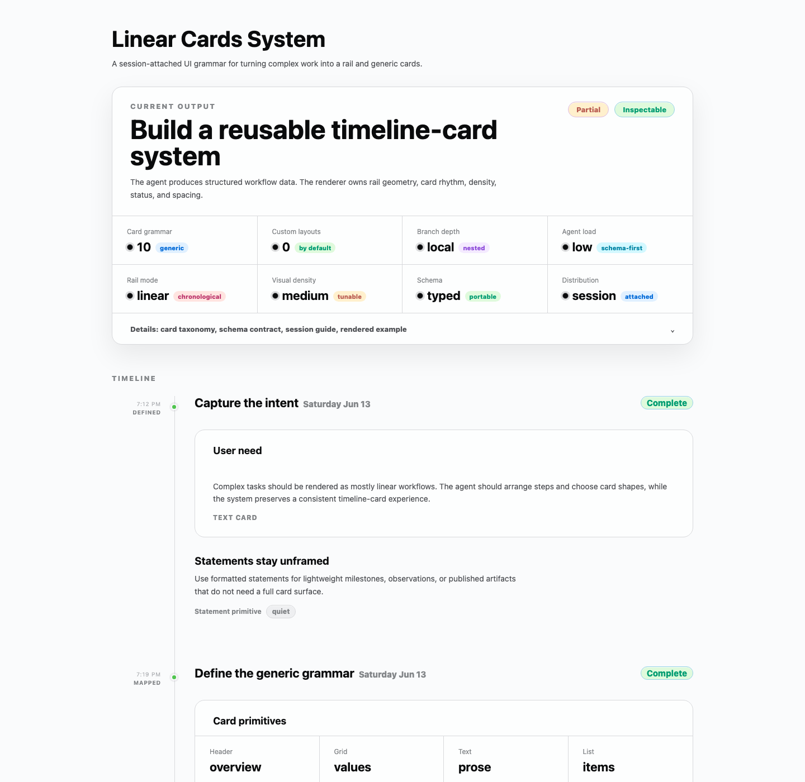

# Linear Cards System

A session-attached workflow UI grammar for rendering complex work as a mostly linear rail with structured cards and quiet statements.



## Purpose

Complex tasks often have the same shape: a sequence of steps, occasional branches, evidence, state changes, outputs, and follow-up actions.

Linear Cards System gives coding agents a constrained UI grammar for that shape. Instead of redesigning workflow UI from scratch, an agent maps the task into a `LinearCardsDocument`, chooses generic information primitives, and lets the renderer own the rail, spacing, surfaces, status styling, and responsive behavior.

The goal is not to make every item a card. The system intentionally mixes:

- a mostly linear timeline rail
- framed cards for structured or grouped information
- unframed statements for lightweight notes and milestones
- vivid color used only as small state or emphasis signals

## When To Use It

Use Linear Cards System when an interface needs to show process, progress, auditability, or stepwise reasoning:

- coding task progress
- research workflows
- evaluation runs
- operational checklists
- math or reasoning traces
- build/deploy pipelines
- artifact and evidence trails
- agent-generated work summaries

It is especially useful when a downstream coding agent should focus on the domain logic and produce UI by filling a schema, not inventing a layout system.

## Quick Start

Install from npm:

```bash
npm install @humanbased/linear-cards-system
```

Use it in a React app:

```tsx
import { LinearCardsTimeline } from "@humanbased/linear-cards-system";
import type { LinearCardsDocument } from "@humanbased/linear-cards-system";
import "@humanbased/linear-cards-system/css";
```

Run the local demo from this repo:

```bash
npm install
npm run dev
```

Open the local URL printed by Vite.

## React Usage

```tsx
import { LinearCardsTimeline } from "@humanbased/linear-cards-system";
import type { LinearCardsDocument } from "@humanbased/linear-cards-system";
import "@humanbased/linear-cards-system/css";

const document: LinearCardsDocument = {
  title: "Linear Cards System",
  sourceHref: "https://github.com/humanbased-ai/linear-cards-system",
  nodes: [
    {
      id: "capture-intent",
      title: "Capture the intent",
      status: "complete",
      rail: { time: "7:12 PM", label: "DEFINED", markerTone: "good" },
      cards: [
        {
          type: "text",
          title: "User need",
          body: "Represent complex work as a mostly linear workflow.",
        },
        {
          type: "statement",
          title: "Statements stay unframed",
          body: "Use statements for lightweight milestones or notes.",
          badges: [{ label: "quiet", tone: "muted" }],
        },
      ],
    },
  ],
};

export function App() {
  return <LinearCardsTimeline document={document} />;
}
```

## Agent Usage

This system is meant to be session-attached, not a permanent project rule.

When a user asks for Linear Cards, an agent can load:

```txt
agent/LINEAR_CARDS_SESSION.md
```

Then for the current task only:

1. Identify workflow nodes.
2. Assign each node a title, rail label, optional time, and status.
3. Select generic primitives by information shape.
4. Fill the card or statement data.
5. Render through `LinearCardsTimeline`.
6. Tune tokens only if the visual tone needs adjustment.

If the downstream harness exposes UI quality skills, ask it to load `impeccable` and its taste/frontend design skill for the current session before finalizing. The intent is a temporary quality pass, not permanent agent configuration.

## Information Primitives

Choose primitives by information shape, not domain meaning:

- `header`: overview, current item, selected item, or workflow summary
- `grid`: labeled values, stats, properties, comparison cells
- `text`: explanation, notes, reasoning, summary, observation
- `list`: ordered or unordered items, checks, subtasks, constraints
- `split`: input/output, before/after, cause/effect, side-by-side comparison
- `branch`: local conditional paths, alternatives, fallback routes
- `reference`: links, files, citations, logs, assets, records
- `statement`: unframed formatted text for lightweight milestones, observations, or published artifacts
- `state`: success, warning, failure, blocked, pending, running, partial
- `action`: commands, approvals, next steps, user choices
- `disclosure`: collapsed deeper details

## Layout Guidance

Use the rail to create sequence, then mix framed cards with unframed statements:

- Use cards when information needs comparison, grouping, actions, disclosure, or a strong state boundary.
- Use `statement` when the item is a lightweight milestone, note, observation, artifact announcement, or contextual sentence.
- Keep one dominant card per node when possible. Add statements before or after it to reduce card fatigue.
- Let margin create focus: larger gaps between rail nodes, moderate padding inside cards, and narrow text measures for statements.
- Avoid filling every timeline stop with a full card. Quiet layouts come from contrast between dense modules and open text.
- Tune spacing through shared CSS tokens and primitives before adding one-off margins.

## Palette Guidance

Use black and white as the main material. Keep surfaces near-white, text near-black, and borders neutral. Use vivid colors only as decoration for state, selection, deltas, markers, and small chips:

- `blue`: primary signal, links, selected tools
- `violet`: branching, choices, alternatives
- `lime`: success, completion, healthy state
- `rose`: risk, failure, destructive state
- `amber`: warning, attention, pending state
- `cyan`: references, evidence, informational state

Prefer assigning these through `tone` values instead of writing one-off CSS.

## Development

```bash
npm run build
```

The demo source lives in `src/linear-cards/examples.ts`.

## Status

This repository is an early open-source prototype built by Humanbased.

It includes:

- a React/Vite demo app
- a typed `LinearCardsDocument` model
- a reusable timeline/card renderer
- a CSS token layer for the visual system
- a session-attached agent guide

## License

MIT
